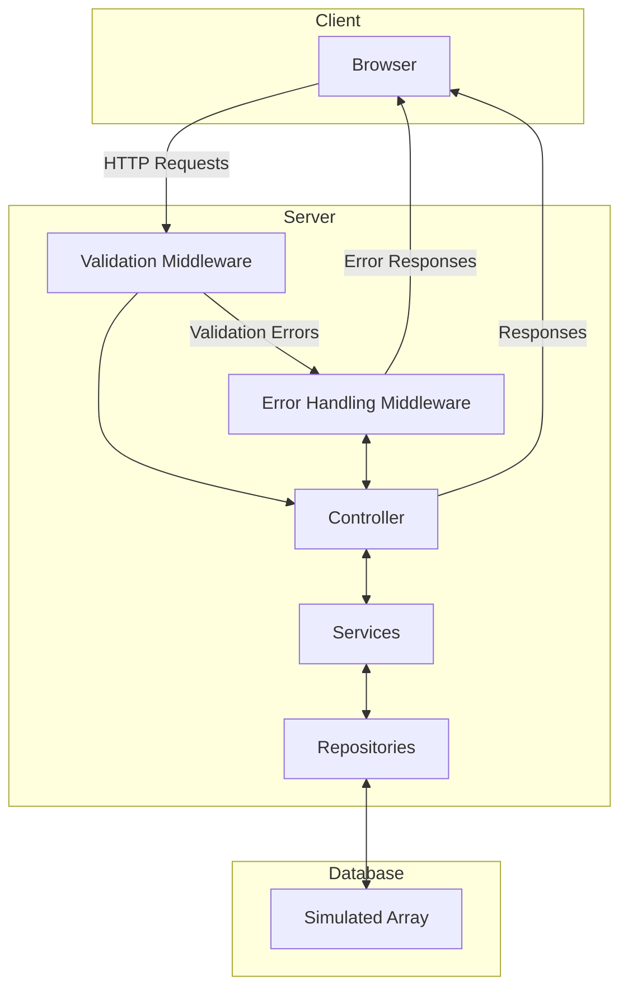
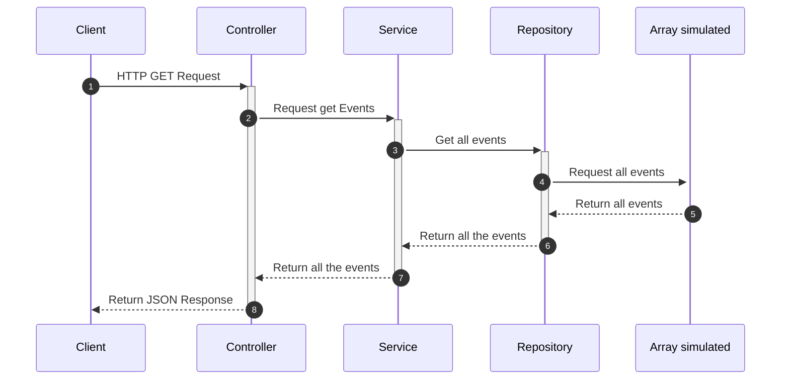

## Backend Documentation for "Kumojin Challenge API"

### Table of Contents
1. [Project Name](#1-project-name)
2. [General Description](#2-general-description)
3. [General Architecture](#3-general-architecture)
    - [Design Pattern Description](#31-design-pattern-description)
    - [Design Pattern Benefits](#32-design-pattern-benefits)
4. [Technologies Used](#4-technologies-used)
5. [Business Logic in the Service Layer](#5-business-logic-in-the-service-layer)
    - [Creating Events](#51-creating-events)
    - [Retrieving All Events](#52-retrieving-all-events)
    - [Searching Events by Name](#53-searching-events-by-name)
6. [Input Parameter Validation](#6-input-parameter-validation)
7. [API Endpoints](#7-api-endpoints)
    - [Create an Event](#71-create-an-event)
    - [Retrieve All Events](#72-retrieve-all-events)
    - [Search Events by Name](#73-search-events-by-name)
8. [Error Handling](#8-error-handling)
9. [Deployment](#9-deployment)
10. [Scalability and Performance](#10-scalability-and-performance)
11. [Security](#11-security)
12. [Additional Documentation](#12-additional-documentation)
13. [Errors](#13-errors)

### 1. Project Name
**Kumojin Challenge API**

### 2. General Description
"Kumojin Challenge API" is an API designed to manage events. It allows users to save events, display them, and search for them by name. Each event includes relevant information such as name, description, start date, and end date.

### 3. General Architecture
The API architecture follows a **Controller, Services, Repositories** design pattern.

#### 3.1. Design Pattern Description
The **Controller, Services, Repositories** pattern is a software architecture that organizes application logic into three main layers:

- **Controller**: This layer handles incoming HTTP requests and outgoing HTTP responses. Its responsibility is to receive client requests, invoke necessary operations in the service layer, and return the result to the client. Controllers should contain minimal logic, delegating most of the work to services.

- **Services**: This layer contains the business logic of the application. Services perform complex operations, validations, and data transformations. They also coordinate interaction between the controller layer and the repository layer. Services allow encapsulating business logic, making it easier to reuse and test.

- **Repositories**: This layer handles interaction with the database or any other data storage system. Repositories provide methods to perform CRUD operations (create, read, update, and delete) on data. Using repositories allows changing the data storage implementation without affecting business logic or the controller interface.

#### 3.2. Design Pattern Benefits

1. **Separation of Concerns**:
   - Each layer has a clear and well-defined responsibility, which makes the code easier to understand and maintain.
   - Controllers handle client interaction, services manage business logic, and repositories handle data access.

2. **Ease of Testing**:
   - This pattern allows for more effective unit testing. Layers can be tested in isolation.
   - Mocks or stubs can be used for lower layers (e.g., repository mocks in service tests), facilitating unit testing without relying on a real database.

3. **Code Reusability**:
   - Business logic in services can be reused by different controllers.
   - Data access methods in repositories can be reused by multiple services.

4. **Maintainability and Scalability**:
   - Well-structured and modular code is easier to maintain and scale.
   - New functionalities can be added with less risk of introducing errors in unrelated parts of the application.
   - The architecture facilitates teamwork, allowing different developers to work on different layers or components of the application without interference.

5. **Flexibility in Data Access**:
   - The abstraction provided by the repository layer allows changing the database or data storage implementation without affecting business logic.
   - This is particularly useful in applications that may evolve to support multiple types of storage (e.g., switching from an SQL database to NoSQL).

### 4. Technologies Used
- **Programming Language**: TypeScript
- **Runtime**: Node.js
- **Main Framework**: Express
- **Database**: Simulated using an array in the repository layer
- **Other Tools**: Suggested but not yet implemented: Docker for containerization and GitHub Actions for CI/CD.

### 5. Business Logic in the Service Layer

The service layer is the core of the business logic in the application. It processes requests from the controller layer, applies business rules, and coordinates interaction with the repository layer. Below are the main operations performed in the service layer:

#### 5.1. Creating Events
- **Date Validation**: Upon receiving a request to create a new event, the service layer checks that the start date (`startDate`) is not later than the end date (`endDate`).
- **Interaction with Repositories**: Once dates are validated, the event data is sent to the repository layer to be stored. No additional validations are performed in the service layer as the data has been previously validated by the parameter validation middleware.

#### 5.2. Retrieving All Events
- **Data Retrieval**: The service layer requests the list of stored events from the repository layer.
- **Response Formatting**: Retrieved data is properly formatted to be sent back to the client, ensuring dates are returned in UTC.

#### 5.3. Searching Events by Name
- **Parameter Validation**: The service layer validates the search parameter (name) to ensure it is not empty and meets requirements.
- **Data Filtering**: The repository layer is queried to retrieve events that match the given name.
- **Response Formatting**: Search results are formatted and returned to the client.

### 6. Input Parameter Validation

The project includes middleware to validate input parameters. This middleware checks parameters before passing them to the appropriate controller, ensuring all requests meet defined requirements. Validations are configured in a validation file where the endpoint and details of each parameter are specified, including the type of validation and the corresponding error code. Conditions verified include:

- **Is Null**: Checks if the parameter is present.
- **Is Empty**: Checks if the parameter has a value.
- **Max Length**: Checks that the parameter does not exceed a defined maximum length.
- **ISO 8601 Date Format**: Checks that dates are in the correct format.

In case of error, an error list is generated following the [RFC 7807](https://tools.ietf.org/html/rfc7807) format to ensure clear and consistent understanding for both development and QA.

### 7. API Endpoints

#### 7.1. Create an Event
- **HTTP Method**: `POST`
- **Endpoint** 
    ```
    POST /events
    ```
- **Input parameters**
  
  |**Parameter**|**Type**|**Mandatory**|**Maximum size**|**Description**|
  |-----------|------|---|--|---------------------------------------------|
  |name|string|✅|32|The name of the event|
  |description|string|✅||The description of the event|
  |startDate|string|✅|29|The start date of the event in ISO 8601 format|
  |endDate|string|✅|29|The end date of the event in ISO 8601 format|
  
- **Request body**
    ```json
    {
        "name": "event name",
        "description": "event description",
        "startDate": "2024-06-14T13:45:30+02:00",
        "endDate": "2024-06-16T13:45:30+02:00"
    }
    ```
- **Responses**
    * 201 Created Successful response
    * 400 Bad request
    * 500 Internal server eroor
- **Respond Body**
    ```json
    {
        "id": 1,
        "name": "event name",
        "description": "event description",
        "startDate": "2024-06-14T13:45:30+02:00",
        "endDate": "2024-06-16T13:45:30+02:00"
    }
    ```
- **Authentication**
    No authentication 
- **Description**: Creates a new event.
- **Implementation**:
  - **Controller**: Create an endpoint that receives a POST request at `/events`. Extract the parameters `name`, `description`, `startDate`, and `endDate` from the request body.
  - **Services**: Check that `startDate` is not later than `endDate`. Delegate the creation of the event to the repository.
  - **Repositories**: Store the event in the simulated array. Generate a unique identifier for the event.
  - **Validation Middleware**: Validate that required fields are present and correct (e.g., `name` does not exceed 32 characters, `startDate` and `endDate` are in ISO 8601 format).
  - **Responses**: Send a response with the created event, including its unique identifier.

#### 7.2. Retrieve All Events
- **HTTP Method**: `GET`
- **Endpoint**: 
    ```
    GET /events
    ```
- **Query parameters**
    no query parameters
- **Responses**
    * 200 OK Successful response
    * 500 Internal server eroor
- **Respond Body**
    ```json
    [
        {
            "id": 1,
            "name": "event name",
            "description": "event description",
            "startDate": "2024-06-14T13:45:30+02:00",
            "endDate": "2024-06-16T13:45:30+02:00"
        },
        {
            "id": 2,
            "name": "event 2 name",
            "description": "event description",
            "startDate": "2024-06-14T13:45:30+02:00",
            "endDate": "2024-06-16T13:45:30+02:00"
        },
    ]
    ```
- **Authentication**
    No authentication 
- **Description**: Returns a list of all events.
- **Implementation**:
  - **Controller**: Create an endpoint that receives a GET request at `/events`.
  - **Services**: Request the list of stored events from the repository.
  - **Repositories**: Return all events stored in the simulated array.
  - **Responses**: Format and return the list of events to the client.

#### 7.3. Search Events by Name
- **HTTP Method**: `GET`
- **Endpoint**: 
    ```
    GET /events/:name
    ```
- **Query parameters**
    name(string): name to search
- **Responses**
    * 200 OK Successful response
    * 500 Internal server eroor
- **Respond Body**
    ```json
    [
        {
            "id": 1,
            "name": "event name",
            "description": "event description",
            "startDate": "2024-06-14T13:45:30+02:00",
            "endDate": "2024-06-16T13:45:30+02:00"
        },
        {
            "id": 2,
            "name": "event 2 name",
            "description": "event description",
            "startDate": "2024-06-14T13:45:30+02:00",
            "endDate": "2024-06-16T13:45:30+02:00"
        },
    ]
    ```
- **Authentication**
    No authentication 
- **Example Error**:
  ```json
  {
    "type": "https://example.com/probs/out-of-credit",
    "title": "You do not have enough credit.",
    "status": 403,
    "detail": "Your current balance is 30, but that costs 50.",
    "instance": "/account/12345/transactions/abc"
  }
- **Description**: Searches for events by name.
- **Implementation**:
  - **Controller**: Create an endpoint that receives a GET request at `/events/{name}`. Extract the `name` parameter from the URL.
  - **Services**: Validate that the `name` parameter is not empty. Delegate to the repository to search for events that match the name.
  - **Repositories**: Filter the events in the simulated array that match the provided name.
  - **Responses**: Format and return the list of matching events to the client.

### 8. Error Handling
- **Error Handling Middleware**: A dedicated middleware catches errors from various layers of the application as well as input validation errors.
- **Error Format**: Errors follow the response format defined in [RFC 7807](https://tools.ietf.org/html/rfc7807), ensuring clear and consistent understanding for both development and QA.
- **Example Error**:
  ```json
  {
    "type": "https://example.com/probs/out-of-credit",
    "title": "You do not have enough credit.",
    "status": 403,
    "detail": "Your current balance is 30, but that costs 50.",
    "instance": "/account/12345/transactions/abc"
  }
  ```
### 9. Deployment
* Deployment Environment: Suggested to use AWS (Amazon Web Services) for deployment, although not yet implemented.
* CI/CD Processes: Suggested to use GitHub Actions for continuous integration and delivery. Docker is suggested for building and deploying application containers, although not yet implemented.
### 10. Scalability and Performance
* Auto-scaling: Suggested to use Kubernetes for auto-scaling containers based on demand, although not yet implemented.
* Caching: Suggested to use Redis to cache frequent responses and improve performance, although not yet implemented.
### 11. Security
* Encryption: Not implemented, data is transmitted over HTTP.
* Access Control: Not yet implemented in the current API.
### 12. Additional Documentation
* Architecture Diagram: The following diagram represents the architecture of the "Kumojin Challenge API": 

* Data Flow: Documentation on how data flows through the API, from request to response.


### 13. Errores
Errors are defined in an errorCodes file, using a dictionary that specifies their error code, HTTP status, and error message.

|**Http status**|**Error code**|**Message**|
|---|----|-------------------------------------------------------------|
|400|1001|The field Name is required|
|400|1002|The field Name cannot be empty|
|400|1003|The field Name must be less than 32 characters|
|400|1004|The field Description is required|
|400|1005|The field Description cannot be empty|
|400|1006|The field StartDate is required|
|400|1001|The field StartDate cannot be empty|
|400|1008|The field StartDate has an invalid datetime ISO 8601 format|
|400|1009|The field EndDate is required|
|400|1010|The field EndDate cannot be empty|
|400|1011|The field EndDate has an invalid datetime ISO 8601 format|
|400|1012|The field StartDate must be less than EndDate|
|400|1013|Invalid JSON format|
|400|1014|Unexpected JSON format|
|404|2001|Event not found|
|500|4001|Database error|
|500|5001|Internal server error|


